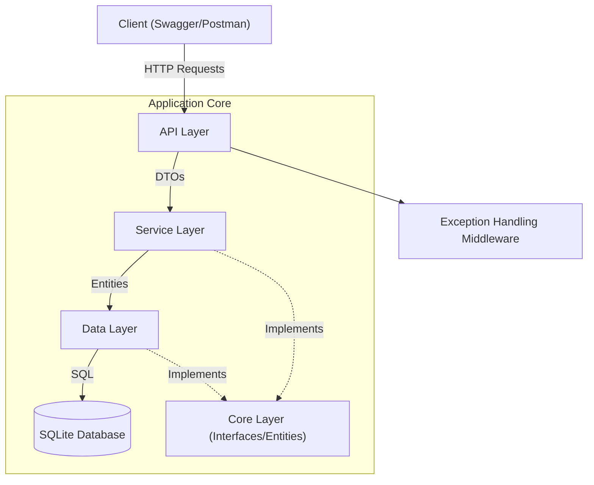

# WebApplication1 API - .NET 9

This project is a robust **.NET 9 Web API** application designed to demonstrate a clean **Layered Architecture** (N-Tier). It implements essential modern API features including **Entity Framework Core** with SQLite, **JWT Authentication**, **AutoMapper**, **Global Error Handling**, and **Repository Pattern**.

## 🏗️ Architecture Diagram

The application follows a strict separation of concerns:



- **Core**: Contains domain entities, DTOs, interfaces, and shared models. It has no dependencies on other layers.
- **Data**: Implements EF Core configuration, DbContext, and Repositories.
- **Service**: Contains business logic, AutoMapper profiles, and Service implementations.
- **API**: The entry point (Controllers & Minimal APIs), DI configuration, and Middleware.

## 🌱 Seed Data (Auto-Generated)
The application automatically creates the following data on startup if the database is empty:
- **User**: username: `seed_user`, password: `12345` (Role: Admin)
- **Collections**: Elektronik, Kitap
- **Merchandises**: Laptop, Telefon, Roman
- **Purchases**: One sample purchase for `seed_user` containing a Laptop.

## 🚀 Setup Instructions

1. **Prerequisites**: Ensure you have [.NET 9 SDK](https://dotnet.microsoft.com/download/dotnet/9.0) installed.
2. **Clone**: Clone this repository.
3. **Build**:
   ```bash
   dotnet build
   ```
4. **Run**:
   ```bash
   dotnet run --project WebApplication1
   ```
   - The application will automatically create the SQLite database (`app.db`) on startup.
5. **Explore**: Open your browser to the Swagger URL shown in the console (typically `http://localhost:5259/swagger`).

## 📡 Endpoints

### 🔐 Authentication
| Method | Endpoint | Description |
| :--- | :--- | :--- |
| `POST` | `/api/Auth/register` | Register a new user (Default Role: Admin) |
| `POST` | `/api/Auth/login` | Login to receive a JWT Bearer Token |

### 📦 Merchandises (Controllers)
*Requires Authorization*
| Method | Endpoint | Description |
| :--- | :--- | :--- |
| `GET` | `/api/Merchandises` | List all merchandises |
| `GET` | `/api/Merchandises/{id}` | Get specific merchandise details |
| `POST` | `/api/Merchandises` | Create a new merchandise |
| `PUT` | `/api/Merchandises/{id}` | Update a merchandise |
| `DELETE` | `/api/Merchandises/{id}` | Soft delete a merchandise |

### 🛒 Purchases (Business Logic)
*Requires Authorization*
| Method | Endpoint | Description |
| :--- | :--- | :--- |
| `POST` | `/api/Purchases` | Create a new purchase (Calculates TotalAmount automatically) |
| `GET` | `/api/Purchases` | List all purchases with deep details (Items & User) |
| `GET` | `/api/Purchases/{id}` | Get specific purchase details |

### 📂 Collections (Minimal API)
| Method | Endpoint | Description |
| :--- | :--- | :--- |
| `GET` | `/api/collections` | List all collections |
| `POST` | `/api/collections` | Create a collection |

## 📝 API Response Examples

All API responses follow a standard wrapper format:

**Success Response (200 OK):**
```json
{
  "success": true,
  "message": "",
  "data": {
    "id": 1,
    "name": "Laptop",
    "price": 15000,
    "stock": 50
  }
}
```

**Error Response (404/500):**
```json
{
  "success": false,
  "message": "Merchandise not found",
  "data": null
}
```

**Purchase Response (with calculated details):**
```json
{
  "success": true,
  "message": "Debug Log: ...",
  "data": {
    "id": 5,
    "totalAmount": 30000,
    "purchaseItems": [
      {
        "merchandiseName": "Laptop",
        "quantity": 2,
        "unitPrice": 15000
      }
    ]
  }
}
```
