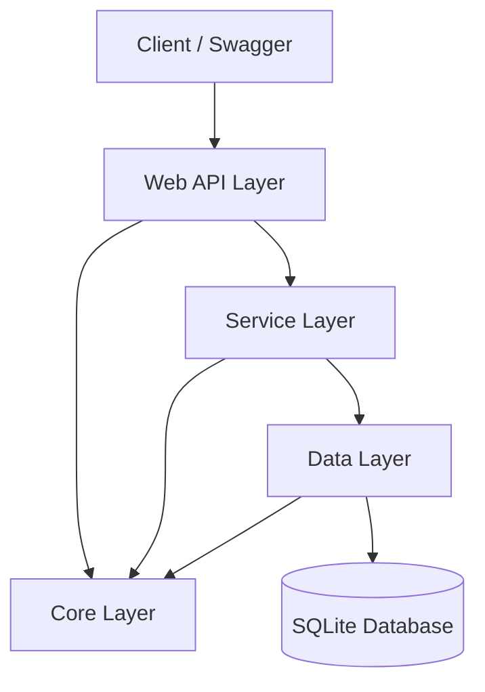

# .NET 9 REST API Projesi

Bu proje, **.NET 9** kullanılarak geliştirilmiş, **Katmanlı Mimari (Layered Architecture)** prensiplerine uygun, **Minimal API** ve **Controller** yapılarının hibrit olarak kullanıldığı bir RESTful API uygulamasıdır. Veri erişimi için **Entity Framework Core** ve **SQLite** kullanılmıştır.

## 📋 Proje Açıklaması

Bu API, e-ticaret benzeri basit bir domain üzerine kurgulanmıştır. Kullanıcılar (User), Satın Alımlar (Purchase), Ürünler (Merchandise) ve Koleksiyonlar (Collection) gibi temel varlıkları yönetir.

### Öne Çıkan Özellikler & Gereksinim Karşılamaları
- **.NET 9 & C# 13**: En güncel teknoloji yığını.
- **Katmanlı Mimari**: `Core`, `Data`, `Service` ve `API (Web)` katmanları.
- **RESTful Tasarım**: Standart HTTP metodları (GET, POST, PUT, DELETE) ve uygun statu kodları.
- **Generic Repository & Unit of Work**: Kod tekrarını önleyen veri erişim kalıpları.
- **Global Exception Handling**: Merkezi hata yönetimi.
- **Standart API Cevapları**: Tüm çıkışlar `{ success, message, data }` formatındadır.
- **JWT Authentication**: Güvenli kimlik doğrulama.
- **Data Seeding**: Uygulama ayağa kalkarken otomatik veri basma.
- **Soft Delete**: Verilerin fiziksel olarak silinmeyip `IsDeleted` flag'i ile işaretlenmesi.
- **Swagger / OpenAPI**: Otomatik dokümantasyon.

## 🏗 Mimari Diagram

Proje bağımlılıkları ve veri akışı aşağıdaki gibidir:



## 🚀 Endpoint Listesi

> **Not**: Tüm endpointler `/api` prefix'i ile başlar. Detaylı dökümantasyon için projeyi çalıştırıp `/swagger` adresine gidiniz.

### Auth (Kimlik Doğrulama)
- `POST /api/auth/register` - Yeni kullanıcı kaydı.
- `POST /api/auth/login` - Giriş yap ve JWT token al.

### Merchandises (Ürünler - Controller Based)
- `GET /api/merchandises` - Tüm ürünleri getir.
- `GET /api/merchandises/{id}` - ID'ye göre ürün getir.
- `POST /api/merchandises` - Yeni ürün ekle (Admin Rolü Gerekir).
- `PUT /api/merchandises/{id}` - Ürünü güncelle.
- `DELETE /api/merchandises/{id}` - Ürünü (soft) sil.

### Collections (Koleksiyonlar - Minimal API)
- `GET /api/collections` - Koleksiyon listesi.
- `GET /api/collections/{id}` - Detay.
- `POST /api/collections` - Yeni koleksiyon.
- `PUT /api/collections/{id}` - Güncelleme.
- `DELETE /api/collections/{id}` - Silme.

### Purchases (Satın Alımlar)
- `GET /api/purchases` - Kullanıcının siparişleri.
- `POST /api/purchases` - Sipariş oluştur.

## 📦 API Response Örnekleri

Başarılı veya hatalı tüm istekler standart bir format döner.

**Başarılı İstek (200 OK):**
```json
{
  "success": true,
  "message": "",
  "data": {
    "id": 1,
    "name": "Örnek Ürün",
    "price": 150.00,
    "collectionName": "Yaz Sezonu"
  }
}
```

**Hatalı İstek (404 Not Found):**
```json
{
  "success": false,
  "message": "Merchandise not found.",
  "data": null
}
```

**Global Hata (500 Internal Server Error):**
```json
{
  "success": false,
  "message": "Internal Server Error: [Exception Detayı]",
  "data": null
}
```

## 🛠 Kurulum Talimatları

Projeyi yerel ortamınızda çalıştırmak için:

1. **Repoyu Klonlayın:**
   ```bash
   git clone <repo-url>
   cd WebApplication1
   ```

2. **Bağımlılıkları Yükleyin:**
   ```bash
   dotnet restore
   ```

3. **Veritabanını Oluşturun (Opsiyonel):**
   Uygulama her başlangıçta (`Program.cs`) veritabanını otomatik oluşturacak ve Seed verilerini basacaktır. Manuel migration yapmak isterseniz:
   ```bash
   dotnet ef database update --project WebApplication1.Data --startup-project WebApplication1
   ```

4. **Projeyi Çalıştırın:**
   ```bash
   dotnet run --project WebApplication1
   ```

5. **Test Edin:**
   Tarayıcınızda veya Postman'de şu adrese gidin:
   `https://localhost:7153/swagger` (Port numarası `launchSettings.json`'a göre değişebilir)

## 📌 Değerlendirme Kriterleri Kontrol Listesi
- [x] .NET 9 Kullanımı
- [x] Katmanlı Mimari (Core, Data, Service, Web)
- [x] CRUD İşlemleri (Hem Minimal API hem Controller)
- [x] Entity İlişkileri (One-to-Many)
- [x] Standart Response Wrapper (`ServiceResponse<T>`)
- [x] DTO Kullanımı (AutoMapper)
- [x] Global Exception Handling
- [x] Swagger UI Entegrasyonu
- [x] **Bonus**: JWT Auth
- [x] **Bonus**: Soft Delete (`IsDeleted`)
- [x] **Bonus**: Seed Data